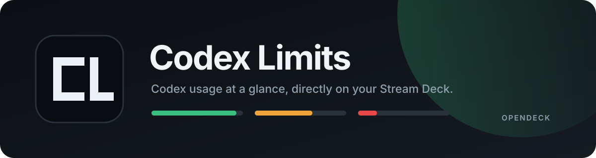
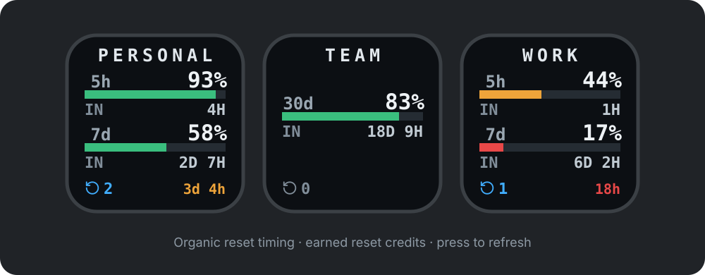

<p align="center">
  
</p>

<p align="center">
  
  
  
  <a href="LICENSE"></a>
</p>

Codex Limits is a native [OpenDeck](https://github.com/nekename/OpenDeck) plugin
that puts the remaining quota for any local Codex account on a Stream Deck key.
Assign one `CODEX_HOME` per key, let the plugin refresh in the background, and
press a key whenever you want a fresh reading.

<p align="center">
  
</p>

## Highlights

- Multiple Codex accounts, configured independently per key
- Dynamic 5-hour, 7-day, monthly, and future window labels
- Side-by-side limit duration and percentage rows at every window size
- Earned reset count and an urgency-colored countdown to the first reset expiry
- Shared in-memory cache and one in-flight request per account
- Configurable polling from 1 minute to 24 hours
- Immediate refresh on key press, with success or failure feedback
- Compact 144×144 rendering designed for physical Stream Deck displays
- No API keys, credential-file parsing, external service, or persistent cache

## Requirements

- Linux x86_64
- OpenDeck 2.13.1 or newer
- A recent Codex CLI with `codex app-server`
- `codex` available on the environment `PATH` used by OpenDeck
- Rust and `zip` when building the package locally

## Build and install

Clone the repository and build the installable package:

```bash
git clone https://github.com/EmilsValdmanis/codex-limits.git
cd codex-limits
./scripts/package.sh
```

The package is written to:

```text
dist/com.emilsvaldmanis.codexlimits.streamDeckPlugin
```

In OpenDeck, open **Settings → Plugins**, install that file, and add the
**Codex Limits** action to a keypad key.

## Configure a key

1. Select a discovered Codex account in the property inspector.
2. Keep the detected subscription name or enter a custom tile name.
3. Choose the background refresh interval.
4. Optionally set a manual `CODEX_HOME` or absolute Codex executable path under
   **Advanced**.

Typical per-key settings:

```json
{
  "codexHome": "/home/user/.codex",
  "label": "PERSONAL",
  "refreshMinutes": 5,
  "codexExecutable": "codex"
}
```

Account discovery checks the inherited `CODEX_HOME`, `~/.codex`, and matching
`~/.codex*` directories that contain Codex state. Long tile names are centered
and truncated only on the key. Accented Latin names are transliterated into the
high-legibility tile alphabet.

## How it works

For each refresh, the plugin starts `codex app-server --stdio` with the selected
`CODEX_HOME`, initializes the documented app-server protocol, calls
`account/rateLimits/read`, normalizes the returned windows, and terminates the
child process. When Codex provides earned rate-limit reset details, the tile
uses the authoritative available count and the earliest available expiry. It
does not start a model turn.

The bottom strip shows a left-pointing circular reset icon followed by `2` for
two available resets. The value on the right (for example, `3d 4h`) is the time
until the first one expires; it changes from green to amber at seven days, then
red at 24 hours. `--` beside the icon means the account service did not provide
reset information; it is distinct from `0`.

Visible keys sharing the same canonical `CODEX_HOME` and executable share a
single cache entry. The shortest configured interval wins, concurrent requests
are coalesced, and hidden keys do not poll.

## Privacy

Authentication remains entirely owned by Codex. The plugin never opens or
copies `auth.json`. Account email and plan are queried with `account/read` only
to identify choices in the local property inspector; email addresses are not
logged, rendered on a key, cached by the account manager, or persisted in
settings.

## Troubleshooting

Check the selected account and app-server outside OpenDeck:

```bash
CODEX_HOME="$HOME/.codex" codex app-server --help
```

OpenDeck plugin logs normally live under:

```text
~/.local/share/opendeck/logs/
```

| Key state | Meaning |
| --- | --- |
| `SET UP` | Select a `CODEX_HOME` |
| `BAD HOME` | The selected directory does not exist |
| `CODEX MISSING` | The configured executable could not be launched |
| `SIGN IN` | The selected Codex home is not authenticated |
| `OFFLINE` | Codex could not reach the upstream service |
| Amber marker | Cached values are shown after a failed refresh |

## Development

Run the complete local gate:

```bash
cargo fmt --check
cargo clippy --all-targets --locked -- -D warnings
cargo test --locked
node --check assets/propertyInspector/inspector.js
./scripts/package.sh
```

See [CONTRIBUTING.md](CONTRIBUTING.md) for local OpenDeck testing and pull
request guidance.

## License

Codex Limits is available under the [MIT License](LICENSE).
